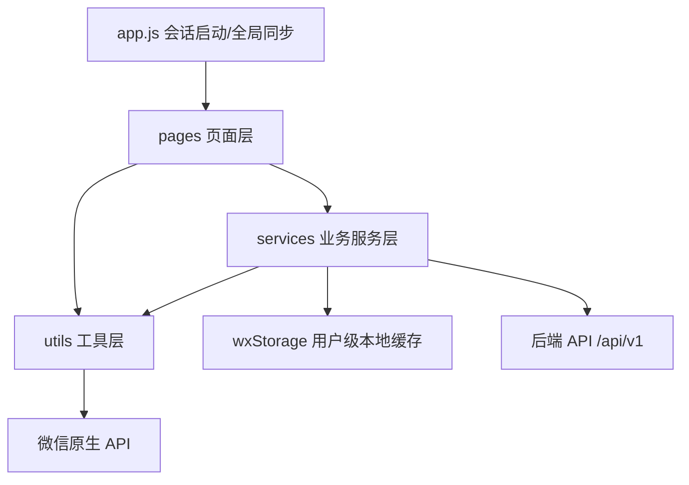
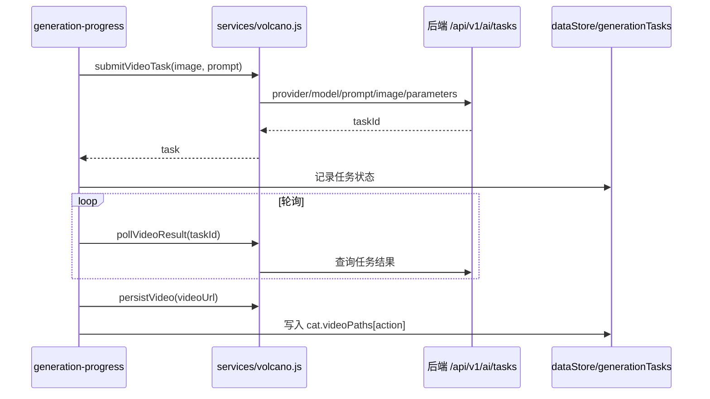

# Miao 原生微信小程序系统分析与优化计划

更新时间：2026-05-13  
分析范围：`native-weapp/miniprogram` 原生微信小程序代码  
验证基线：`npm run check:native` 通过，输出 `native scaffold ok: 36 json files, 56 modules`

## 1. 总体结论

当前原生微信小程序已经不是简单壳工程，而是具备完整 MVP 业务闭环的版本：账号登录注册、猫咪创建、AI 图片/视频生成、首页沉浸互动、积分兑换、日常记录、好友动态、时光信件、通知、个人中心、隐藏后台配置、隐私反馈等能力均已落地。

整体架构采用“页面层 + 服务层 + 工具层 + 本地缓存”的清晰分层，业务大多集中在 `services` 下，页面负责交互状态和路由，适合继续迭代。但也存在几类需要优先处理的问题：

- 业务一致性：好友二维码入口传入了 `catId`，但创建邀请时仍使用当前 active cat，可能生成错猫邀请。
- 配置一致性：火山默认视频清晰度来自 `env.js` 的 `720p`，阿里默认是 `480P`，需要和业务目标统一。
- 可靠性：生成兑换扣分和退款依赖页面内存状态，页面销毁后幂等风险较高。
- 体验反馈：反馈提交接口失败时仍显示成功；首页主要互动依赖隐藏手势，缺少可见替代入口。
- 可维护性：`sync-queue.js` 仅入队和持久化，未发现消费调度入口，离线同步闭环不完整。

## 2. 工程结构

```text
native-weapp/
├── project.config.json          # 微信开发者工具项目配置，miniprogramRoot 指向 miniprogram/
├── scripts/check.js             # 原生小程序静态检查脚本
├── miniprogram/
│   ├── app.js / app.json / app.wxss
│   ├── config/env.js            # API、客户端、AI 默认配置
│   ├── pages/                   # 31 个页面入口
│   ├── services/                # 认证、数据、内容、社交、同步、AI 生成
│   ├── utils/                   # request/upload/media/nav/layout/storage 等工具
│   ├── components/tab-bar/      # 自定义底部导航
│   └── assets/                  # 图标与图片资源
└── docs/                        # 迁移、验收、视觉对比文档
```

架构关系：



## 3. 已实现功能清单

| 模块 | 主要页面/文件 | 已实现能力 |
|------|---------------|------------|
| 启动与会话 | `app.js`, `welcome` | token 与缓存用户恢复、`/api/v1/me` 校验、前台同步、未登录跳转 |
| 账号体系 | `login`, `register`, `reset-password`, `change-password`, `set-nickname` | 密码登录、注册、微信登录、手机号登录、找回/设置密码、资料修改 |
| 猫咪创建 | `empty-cat`, `create-companion`, `upload-material` | 预设猫选择、上传素材、锚点图片生成、生成前置校验 |
| AI 生成 | `generation-progress`, `services/volcano.js`, `services/ai-config.js` | 图片任务、视频任务、轮询、Mock 模式、Provider/模型/参数配置 |
| 首页互动 | `home`, `cat-player` | 沉浸视频播放、动作切换、手势互动、视频错误重试、补齐动作 |
| 猫咪管理 | `switch-companion`, `cat-history` | 切换、列表、历史、删除、兑换解锁入口 |
| 日常记录 | `diary` | 自己/好友动态、图文/视频发布、点赞、评论、分享、媒体重选 |
| 好友社交 | `add-friend-qr`, `join-friend`, `scan-friend`, `social-store` | 邀请码、二维码、扫码、接受邀请、好友动态同步 |
| 时光信件 | `time-letters` | 写信、倒计时解锁、已读状态、按猫筛选、调试快进 |
| 积分系统 | `points`, `content-store` | 登录、互动、在线、日记等奖励，兑换门槛，本地/服务端同步 |
| 通知 | `notifications`, `notification-list` | 通知设置、消息列表、已读、跳转目标 |
| 个人中心 | `profile`, `edit-profile`, `privacy-settings`, `download`, `feedback` | 资料展示、设置、缓存清理、反馈问卷、法律隐私入口 |
| 隐藏后台 | `admin-settings` | AI Provider/模型/参数、预设猫管理、积分作弊、时光快进 |

## 4. 关键业务流程

### 4.1 登录与启动

`app.js` 在启动时读取 token 和缓存用户。若存在登录态，会调用 `/api/v1/me` 获取最新用户信息，并触发 `syncManager.syncAll()`；若失败但本地仍有缓存用户，会暂时保留离线可用状态。

优点：启动容错较好，不会因为一次网络失败直接清空用户。  
风险：如果 token 已失效但 `/me` 请求失败不是 401，可能继续以缓存用户进入，后续请求再触发 401 清理。

### 4.2 AI 生成链路

生成相关配置来自 `aiConfig.getProfile()`：

- Provider：`dashscope` 或 `volcengine`
- 图片模型：默认火山 `doubao-seedream-4-5-251128`
- 视频模型：默认火山 `doubao-seedance-1-5-pro-251215`
- 清晰度：火山当前来自 `env.js` 的 `720p`，阿里默认 `480P`
- 时长：默认 5
- Seed：默认 12345
- Prompt Extend：默认开启
- Mock Mode：默认关闭

视频生成流程：



当前小程序视频生成只传一个首帧图片参数；如果后端已经支持首尾帧，原生小程序后续也应显式支持 first/last frame 传参和后台开关。

### 4.3 数据与同步

本地缓存使用 `userScopedKey(username, key)` 做用户隔离。`syncManager` 以 30 秒冷却控制全量同步频率，并用 `Promise.allSettled` 避免单个接口失败拖垮全部同步。

已同步的数据包括猫咪、日志、信件、积分、通知、好友和好友动态。未完全闭环的是 `sync-queue.js`：它能保存 pending task，但没有看到实际消费与重试调度。

### 4.4 社交与好友邀请

日志页添加好友流程允许先选择代表猫咪，并把 `catId` 传给 `/pages/add-friend-qr/index?catId=...`。但 `add-friend-qr` 当前没有读取该参数，`socialStore.createInvite()` 也只读取 `dataStore.getActiveCat()`。这会导致用户明明选择了 A 猫，生成邀请时可能用了当前 active 的 B 猫。

## 5. 问题与优化点

| 优先级 | 类型 | 问题 | 影响 | 建议 |
|--------|------|------|------|------|
| P0 | 业务正确性 | 好友邀请忽略入口 `catId` | 选择代表猫咪后可能生成错猫邀请 | `add-friend-qr` 保存 query catId，`socialStore.createInvite(catId)` 按 catId 找猫 |
| P0 | 用户反馈 | 反馈/问卷提交失败仍显示成功 | 用户误以为反馈已提交，运营数据丢失 | catch 中提示失败，不清空表单，不标记已提交 |
| P1 | 配置一致性 | 火山默认 `720p`，阿里默认 `480P` | 生成成本、效果和业务预期可能不一致 | 统一默认值与后台可选项，必要时迁移旧缓存 |
| P1 | 配置安全性 | 后台 AI 参数都是自由输入 | 容易误填模型、清晰度、时长导致生成失败 | 清晰度/时长改 picker 或合法值校验 |
| P1 | 生成可靠性 | 兑换扣分状态只在页面内存中 | 页面销毁后退款/恢复不可靠 | 将扣分事务写入持久化生成任务 |
| P1 | 同步闭环 | `sync-queue` 无消费入口 | 离线失败任务不会统一重试 | 接入 app 前台同步或移除未使用队列 |
| P1 | 首页体验 | 关键动作依赖隐藏手势 | 新用户难发现互动方式 | 增加轻量动作浮层/一次性引导/可见动作入口 |
| P2 | 时光信件 | 删除只改本地 | 服务端同步后可能恢复 | 增加服务端 delete 或本地 tombstone |
| P2 | 表单体验 | 后台模型、Seed 等字段缺少说明 | 调试成本高 | 增加帮助文本、合法值和错误提示 |
| P2 | 视觉一致性 | 各页面卡片圆角、阴影、标题层级存在差异 | 质感不统一 | 抽象 page/card/button token 或按页面逐步统一 |

## 6. 交互体验评估

### 做得好的部分

- 自定义底部导航统一，首页沉浸式体验明确。
- 日常记录的“我的记录/好友动态”切换结构清楚，符合当前产品核心社交场景。
- 后台配置已经独立成页面，移动端相比弹窗更可控。
- 反馈、隐私、通知、资料页覆盖了基本产品设置能力。

### 需要优化的部分

- 首页没有明显操作提示时，双击、长按、滑动动作的学习成本偏高。
- 后台设置底部固定按钮有安全区处理，但表单自由输入较多，配置错误后通常要到生成阶段才暴露。
- 反馈页提交失败静默吞错，属于“结果反馈不诚实”的体验问题，应优先修。
- 日志页添加好友的两步选择流程是合理的，但下游二维码页面没有承接选择结果，体验和业务不一致。

## 7. 推荐开发计划

第一批建议优先做“小改动、强验证、跨流程收益”的任务：

1. 好友邀请 catId 透传修复  
   验证：从日志页选择非当前 active cat 生成二维码，确认请求体里的 catId/name/avatar 对应所选猫。

2. 反馈提交失败处理  
   验证：模拟 `/api/v1/feedback` 失败，页面停留并提示失败；成功时才清空并返回。

3. AI 清晰度默认值与后台输入校验  
   验证：重置后台配置后两套 Provider 清晰度符合业务目标；非法清晰度/时长无法保存。

4. 首页互动可发现性优化  
   验证：首页出现不遮挡主体的轻量动作入口或首次引导，点击动作与原手势共用逻辑。

5. 生成兑换扣分持久化  
   验证：兑换生成中途退出再进入，能根据持久化任务状态判断已扣分、成功不重复扣、失败可退款。

6. 同步队列闭环决策  
   验证：要么接入统一重试，要么删除未使用队列并保持检查通过。

## 8. 验证建议

每个任务至少执行：

```bash
npm run check:native
```

人工验收建议在微信开发者工具中覆盖：

- 登录/注册/退出/重登
- 预设猫创建和上传素材创建
- 火山/阿里配置切换后的图片、视频生成
- 积分兑换解锁新猫失败和成功路径
- 日常记录发布、媒体重选、好友点赞评论
- 好友二维码生成、扫码加入、好友动态同步
- 后台配置保存、恢复默认、重启后读取

## 9. 近期落地优先级

本轮代码开发建议先实施前 3 项：

- Task 01：好友邀请 `catId` 透传，修复明确业务 bug。
- Task 02：反馈提交失败处理，提升体验可信度。
- Task 03：AI 配置清晰度/参数校验，降低模型调试误配置概率。

## 10. 本轮已实施改动

2026-05-13 已完成第一批 3 个任务：

- 好友邀请 `catId` 透传：二维码页读取入口 `catId`，`socialStore.createInvite(catId)` 优先使用指定猫，找不到时回退 active cat。
- 反馈失败处理：问卷和普通反馈接口失败时不再进入成功页，不清空输入，并给出失败 toast。
- AI 配置校验：火山默认清晰度统一为 `480P`；`ai-config` 增加 profile 标准化/校验；后台保存非法模型/清晰度/时长/Seed 会拦截；视频任务 prompt 会附加当前清晰度、时长、Seed、无音频提示。

已通过验证：

- `npm run check:native`
- Node 直接校验 `validateProfile()` 默认与非法配置返回结果

2026-05-14 已继续完成第二批 3 个任务：

- 首页互动可发现性：恢复首页已有 `action-bar`，调整为底部导航上方的轻量动作入口；按钮点击复用原 `selectAction`，未生成动作仍进入补生成。
- 兑换生成可靠性：`generationTasks` 增加 redemption 事务，生成页会根据持久化状态判断已扣分/已完成/已退款，避免页面重进重复扣分；失败或未生成成功返回编辑页会退款。
- 同步队列闭环：`syncQueue` 增加 `remove/process`，时光信件删除增加 tombstone 与服务端删除；服务端删除失败会进入 pending 队列，`syncManager` 前台同步前会重试。

已通过验证：

- `npm run check:native`
- Node 直接校验 `generationTasks` redemption 状态流转
- Node 直接校验 `SyncQueue.process()` 失败保留任务、成功移除任务
